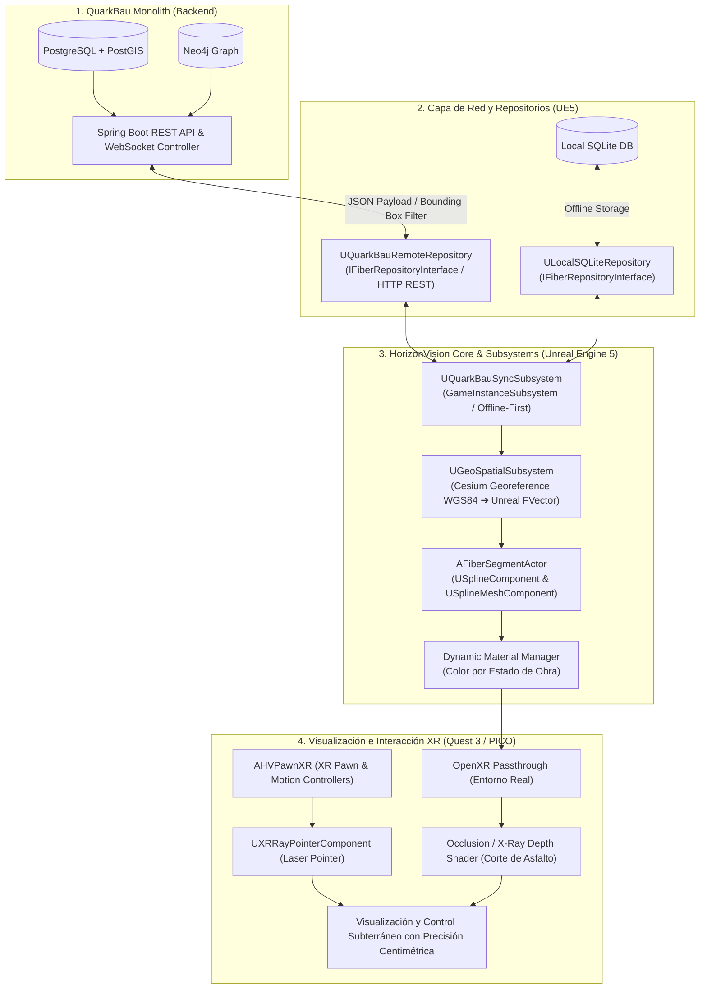

# Plan de Implementación y Arquitectura: Integración QuarkBau Monolith ➔ HorizonVision (MR / Gemelo Digital)

Este documento detalla la arquitectura técnica, el flujo de datos, la estructura de componentes C++ y la comunicación entre servicios para transmitir, georreferenciar y renderizar en tiempo real los segmentos e infraestructuras de **QuarkBau Monolith** (Spring Boot / PostgreSQL + PostGIS) en el visor de Realidad Mixta **HorizonVision** (Unreal Engine 5 + Cesium for Unreal + OpenXR).

---

## 📐 1. Arquitectura General del Sistema



---

## 🚀 2. Particularidades del Framework y Componentes C++

### 📦 2.1. Patrón Repository y Subsystems (Arquitectura Offline-First)
En entornos de obra civil no siempre hay cobertura 4G/5G. HorizonVision implementa una arquitectura **Offline-First**:

* **Subsystems (`UGameInstanceSubsystem`)**:
    * `UQuarkBauSyncSubsystem`: Es el orquestador global de sincronización. Permanece activo en memoria durante toda la sesión. Administra las colas de peticiones y decide cuándo usar datos locales o remotos.
    * `UGeoSpatialSubsystem`: Gestiona la conversión entre coordenadas geográficas WGS84 y el espacio tridimensional local de Unreal Engine.
* **Patrón Repository (`IFiberRepositoryInterface`)**:
    * `ULocalSQLiteRepository`: Lee y escribe datos localmente en una base de datos **SQLite** alojada en el dispositivo XR. Garantiza operatividad sin conexión a internet.
    * `UQuarkBauRemoteRepository`: (Componente de red denominado conceptualmente *UQuarkBauApiService* en planes iniciales). Ejecuta peticiones REST asíncronas vía `FHttpModule` hacia el backend Spring Boot.
* **Flujo de interacción**: `UQuarkBauSyncSubsystem` consulta primero la base local SQLite (`ULocalSQLiteRepository`) para una carga instantánea y, si hay conectividad, sincroniza los cambios en segundo plano mediante `UQuarkBauRemoteRepository`.

### 🌐 2.2. Motor Geoespacial y Conversión de Coordenadas (Cesium)
En Unreal Engine convencional, el mundo se mide en centímetros $(X, Y, Z)$ con origen arbitrario en $(0,0,0)$. HorizonVision trabaja con coordenadas globales **WGS84 (Latitud, Longitud, Altitud)**.

* **`ACesiumGeoreference` & `UGeoSpatialSubsystem`**:
    * Utiliza el plugin **Cesium for Unreal**.
    * Transforma puntos GPS `(Lat, Lng, Alt)` a vectores locales en centímetros (`FVector`), ajustando la elevación con la profundidad requerida (`targetDepthMeters`).
* **Calibración Centimétrica (`ApplyCalibrationOffset`)**:
    * Permite aplicar offset de rotación y posición mediante corrección **GNSS RTK** (vía Bluetooth) o lectura de **marcadores QR/ArUco** en tapas de arquetas reales.

### 🛢️ 2.3. Generación Procedural 3D con Splines (`SplineMesh`)
No existen modelos 3D estáticos precalculados; las canalizaciones se dibujan dinámicamente según la geometría devuelta por la API/SQLite.

* **`AFiberSegmentActor`**:
    * `USplineComponent`: Genera la curva bezier continua siguiendo el trazado de la calle.
    * `USplineMeshComponent`: Extruye mallas cilíndricas a lo largo de los segmentos de la spline.
* **Semáforo Dinámico por Estado de Obra (`UMaterialInstanceDynamic`)**:
    * 🔴 **Rojo (`PLAN`)**: Tramo planificado (no excavado). Marca la línea de corte.
    * 🟡 **Amarillo (`TRENCH_OPEN`)**: Zanja abierta. Guía de profundidad para el maquinista.
    * 🔵 **Azul (`BLOWN`)**: Microconducto instalado y fibra soplada.
    * 🟢 **Verde (`COMPLETED`)**: Zanja cerrada, repavimentada y certificada (*Aufmaß*).

### 🥽 2.4. Realidad Mixta (Passthrough) y Shaders de Oclusión (Rayos X)
* **`AHVPawnXR`**: Pawn especializado para visores VR/AR. Gestiona el origen del visor (`VROrigin`), la cámara HMD, los mandos (`MotionControllerComponent`) y el canal de transparencia **Passthrough**.
* **`UXRRayPointerComponent`**: Puntero láser 3D adjunto a los mandos para seleccionar canalizaciones subterráneas y disparar eventos de cambio de estado o reporte de incidencias (`FIncidentReport`).
* **Shader de Oclusión y Ventana Rayos X (Custom Depth Stencil)**:
    * El suelo/asfalto se renderiza con un material oclusor invisible que escribe en el búfer de profundidad.
    * Oculta las tuberías bajo tierra hasta que el operario activa la máscara de corte "Rayos X".

### 🔌 2.5. Servicios de Comunicación Empresarial
* **`JavaGISService`**: Gestiona peticiones a servicios GIS empresariales e infraestructura BIM (CityGML / IFC).
* **`PythonMLService`**: Puente de comunicación con modelos de Machine Learning / IA (detección de grietas, clasificación de terreno).
* **`SupabaseService`**: Cliente para sincronización auxiliar en la nube.

---

## 📡 3. Comunicación entre Componentes en HorizonVision

Para garantizar un código limpio y mantenible, la comunicación entre componentes sigue reglas estrictas de desacoplamiento:

```mermaid
sequenceDiagram
    autonumber
    actor Operario as Operario (XR Pawn)
    participant Pawn as AHVPawnXR / RayPointer
    participant Sync as UQuarkBauSyncSubsystem
    participant LocalRepo as ULocalSQLiteRepository
    participant RemoteRepo as UQuarkBauRemoteRepository
    participant Actor as AFiberSegmentActor

    Operario->>Pawn: Dispara gatillo (OnTriggerPressed)
    Pawn->>Actor: Raycast detecta AFiberSegmentActor
    Pawn->>Sync: Llama UpdateSegmentState(SegmentId, EWorkflowState::TRENCH_OPEN)
    Sync->>LocalRepo: Guarda nuevo estado en SQLite local (Respuesta Inmediata)
    Sync->>Actor: Notifica evento FOnSegmentUpdated
    Actor->>Actor: Actualiza UMaterialInstanceDynamic a Amarillo
    
    alt Hay Conexión a Internet
        Sync->>RemoteRepo: Llama UpdateSegmentState() vía HTTP PUT a Spring Boot
        RemoteRepo-->>Sync: Callback 200 OK
    else Sin Conexión (Offline)
        Sync->>Sync: Encola petición en SyncQueue para reintento periódico
    end
```

### 🔗 Reglas de Comunicación Técnico-Prácticas:

1. **Lógica en C++ y Exposición a Blueprints**:
    * Las operaciones intensivas (SQLite, HTTP asíncrono, matemáticas de Cesium, generación de splines) están escritas en C++.
    * Se exponen a Blueprints con `UFUNCTION(BlueprintCallable)` para métodos ejecutables y `UFUNCTION(BlueprintPure)` para consulta de datos.
2. **Acceso Global vía Subsystems (`GetGameInstanceSubsystem`)**:
    * Los actores y widgets no se comunican mediante referencias rígidas o acoplamiento directo.
    * Cualquier clase puede obtener una referencia al subsystem mediante:
      `GetGameInstanceSubsystem<UQuarkBauSyncSubsystem>()` o `GetGameInstanceSubsystem<UGeoSpatialSubsystem>()`.
3. **Eventos y Delegados Multicast (`UPROPERTY(BlueprintAssignable)`)**:
    * La comunicación asíncrona (respuestas HTTP, sincronización de estados, actualización de origen GPS) utiliza delegados dinámicos (`OnSegmentsReady`, `OnSegmentUpdated`, `OnOriginUpdated`).
    * Los actores visuales y UI se suscriben a estos eventos y reaccionan de manera desacoplada.
4. **Patrón Interface para Repositorios**:
    * `UQuarkBauSyncSubsystem` opera contra la interfaz `IFiberRepositoryInterface`. Esto permite sustituir o probar repositorios sin modificar la lógica del Subsystem.

---

## 📋 4. Guía Rápida de Herramientas Predeterminadas C++

| Componente C++ | ¿Qué hace? | ¿Cuándo debes tocarlo? |
| :--- | :--- | :--- |
| **`UQuarkBauSyncSubsystem`** | Coordina la base de datos SQLite local con la API de QuarkBau (Offline-First). | Al añadir nuevos tipos de datos sincronizables o modificar la lógica de reintentos. |
| **`UGeoSpatialSubsystem`** | Convierte coordenadas geográficas WGS84 a coordenadas local $XYZ$ de Unreal. | Si cambia la fórmula de conversión, cotas de profundidad o algoritmos de calibración RTK/QR. |
| **`UQuarkBauRemoteRepository`** | Ejecuta las peticiones HTTP REST contra Spring Boot (denominado *UQuarkBauApiService* en el plan inicial). | Al modificar los endpoints de QuarkBau o el formato del payload JSON. |
| **`ULocalSQLiteRepository`** | Gestiona consultas SQL e inserciones en la base SQLite del visor. | Al añadir tablas, índices o migraciones de base de datos local. |
| **`AFiberSegmentActor`** | Genera proceduralmente la tubería 3D en la spline y gestiona los colores de estado. | Al modificar el diámetro del tubo, el shader de resaltado o añadir detalles geométricos. |
| **`AHVPawnXR`** | Pawn de jugador XR que gestiona la vista HMD, mandos, passthrough y puntero láser. | Al implementar nuevas interacciones con las manos, gestos o entradas de hardware XR. |

---

## 🛠️ 5. Estructura de Archivos en HorizonVision

```text
HorizonVision/
├── Source/HorizonVision/
│   ├── Core/
│   │   ├── HorizonGameMode.h / .cpp           # GameMode principal
│   │   └── XR/
│   │       └── HVPawnXR.h / .cpp             # Pawn de jugador con Passthrough y MotionControllers
│   ├── Services/
│   │   ├── QuarkBauSyncSubsystem.h / .cpp    # Subsystem orquestador Offline-First
│   │   ├── GeoSpatialSubsystem.h / .cpp      # Subsystem conversor Cesium WGS84 ➔ FVector
│   │   ├── JavaGISService.h / .cpp           # Servicio HTTP para BIM y GIS empresarial
│   │   ├── PythonMLService.h / .cpp         # Servicio de IA / Machine Learning
│   │   └── SupabaseService.h / .cpp          # Integración cloud secundaria
│   ├── Repositories/
│   │   ├── FiberRepositoryInterface.h        # Interfaz abstracta para datos de fibra
│   │   ├── LocalSQLiteRepository.h / .cpp    # Repositorio base de datos SQLite local
│   │   └── QuarkBauRemoteRepository.h / .cpp # Repositorio cliente HTTP REST (API QuarkBau)
│   ├── Procedural/
│   │   ├── FiberSegmentActor.h / .cpp        # Generador 3D de tuberías sobre USplineComponent
│   │   └── TrenchVolumeActor.h / .cpp        # Volúmenes procedurales de zanjas
│   └── Interaction/
│       └── XRRayPointerComponent.h / .cpp    # Puntero láser XR para interacción 3D
```
