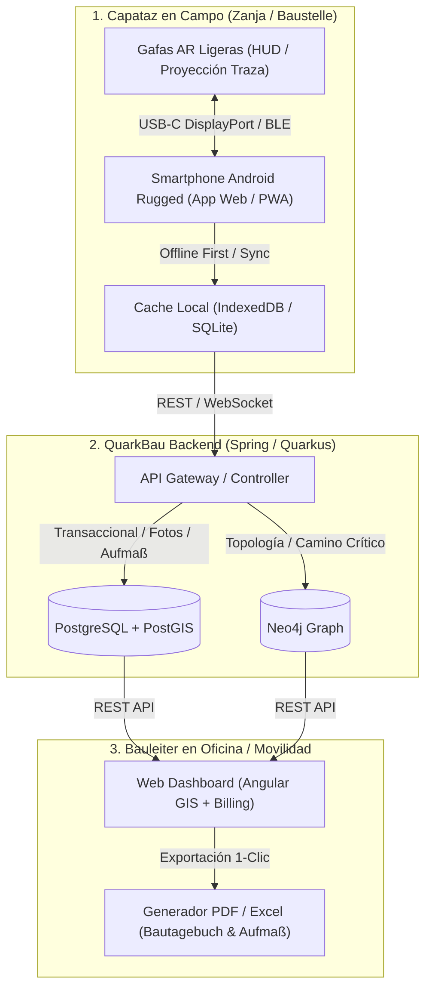

# Plan de Integración: Sistema de Gestión de Obra FTTH (QuarkBau)

Este documento describe la arquitectura, flujo de datos y plan de integración del ecosistema **QuarkBau**, conectando el trabajo en campo del Capataz (**Móvil + Gafas AR ligeras**), el backend (**QuarkBau Monolith: PostgreSQL + Neo4j**) y el centro de control del Bauleiter (**Web Dashboard**).

---

## 1. Arquitectura de Dispositivos y Flujo de Datos



---

## 2. Fases de Integración

```
┌─────────────────────────────────────────────────────────────────────────────┐
│ FASE 1: Núcleo de Campo Híbrido (Móvil + Gafas AR)                          │
├─────────────────────────────────────────────────────────────────────────────┤
│ • App móvil ligera para capataz con captura de fotos geolocalizadas.        │
│ • Modo AR en gafas ligeras: proyección HUD de la traza GIS y profundidad.   │
│ • Almacenamiento local offline y sincronización automática.                 │
└─────────────────────────────────────┬───────────────────────────────────────┘
                                      │
                                      ▼
┌─────────────────────────────────────────────────────────────────────────────┐
│ FASE 2: Motor de Automatización de Cobros (Aufmaß & Bautagebuch)            │
├─────────────────────────────────────────────────────────────────────────────┤
│ • Generación automática del Bautagebuch diario (PDF con firmas y fotos).    │
│ • Cálculo de mediciones (Aufmaßblatt) cruzando metros con BillingUnit (€/m).│
│ • Exportación compatible con estándares de aceptación en Alemania.          │
└─────────────────────────────────────┬───────────────────────────────────────┘
                                      │
                                      ▼
┌─────────────────────────────────────────────────────────────────────────────┐
│ FASE 3: GIS y Centro de Mando del Bauleiter (Web Dashboard)                 │
├─────────────────────────────────────────────────────────────────────────────┤
│ • Mapa interactivo con código de colores por estado real de tramos.         │
│ • Gestión visual de incidencias georreferenciadas (Nachträge).               │
│ • Validación/aprobación de evidencias fotográficas en 1 clic.               │
└─────────────────────────────────────┬───────────────────────────────────────┘
                                      │
                                      ▼
┌─────────────────────────────────────────────────────────────────────────────┐
│ FASE 4: Analítica de Desviaciones y Cuellos de Botella (Postgres + Neo4j)   │
├─────────────────────────────────────────────────────────────────────────────┤
│ • Reglas de negocio: alertas de metros/día reales vs. presupuesto.         │
│ • Neo4j: detección de dependencias bloqueadas y stock crítico de tubos.    │
└─────────────────────────────────────────────────────────────────────────────┘
```

---

## 3. Detalle Técnico por Módulos

### Módulo A: Sistema Híbrido de Campo (Móvil + Gafas AR)
* **Hardware de Campo:**
  * **Gafas AR Ligeras:** Dispositivos ópticos tipo XREAL Air 2, Rokid Max o Vuzix Blade (pantalla transparente tipo HUD, peso < 80g).
  * **Smartphone:** Terminal Android rugerizado conectado por cable USB-C (DisplayPort Alt Mode) o Bluetooth de baja latencia.
* **Funcionalidades para el Capataz:**
  * **Guía Visual HUD:** Proyección de la línea de traza sobre la acera/calzada con indicación de profundidad objetivo (ej. `Profundidad: 60 cm - Acera de adoquín`).
  * **Advertencia de Cruces:** Alerta visual ante cruces conocidos de gas, agua o media tensión.
  * **Captura Rápida de Evidencias (3 Fotos Obligatorias):**
    1. *Tiefenmessung:* Zanja abierta con vara métrica visible.
    2. *Warnband:* Tubo instalado en lecho de arena con cinta de aviso.
    3. *Oberfläche:* Zanja cerrada con superficie reasfaltada o adoquinada.
  * **Offline-First:** Almacenamiento local mediante SQLite/IndexedDB para registrar tramos en zonas rurales sin cobertura 4G/5G con sincronización automática al recuperar red.

### Módulo B: Motor de Cobro y Documentación Legal (*Aufmaß & Bautagebuch*)
* **Entidades Relacionadas:** `Segment`, `WorkLog`, `BillingUnit`, `Evidence`.
* **Automatización del Proceso:**
  1. Consolidación diaria de metros registrados en `WorkLog`.
  2. Multiplicación de metros por precio unitario pactado en `BillingUnit` (`pricePerMeter`, `pricePerCrossing`, `pricePerManHour`).
  3. **Generación con 1 Clic:**
     * **Bautagebuch (Libro Diario de Obra):** Fecha, cuadrilla, climatología, maquinaria, tramos ejecutados y galería de fotos selladas con GPS y timestamp.
     * **Aufmaßblatt (Hoja de Medición Oficial):** Resumen de metros lineales por tipo de superficie listo para certificar y facturar al contratista principal.

### Módulo C: Consola GIS del Bauleiter (`web-dashboard`)
* **Mapa de Estado en Tiempo Real:**
  * 🔴 **Rojo (Pendiente):** Tramo planificado sin inicio de obra civil.
  * 🟡 **Amarillo (En zanja):** Zanja abierta y colocación de tubo en curso.
  * 🔵 **Azul (Soplado / Fusión):** Microconducto verificado, fibra soplada o empalmada.
  * 🟢 **Verde (Completado y Validado):** Zanja cerrada con 3 fotos aprobadas y listo para facturar.
* **Gestión de Incidencias (`incident-report`):**
  * Reporte inmediato con geolocalización de rocas imprevistas, tuberías rotas o permisos pendientes para generar reclamaciones de sobrecoste (*Nachträge*).

### Módulo D: Inteligencia Práctica y Grafo de Dependencias (PostgreSQL + Neo4j)
* **PostgreSQL:** Persistencia transaccional de usuarios, cuadrillas, finanzas, geometrías (`PostGIS`) y metadatos de fotos.
* **Neo4j (Grafo de Red y Cuello de Botella):**
  * Modelo topológico de la red: `(Segment) -[:FEEDS_INTO]-> (Segment) -[:REQUIRES_MATERIAL]-> (SKU)`.
  * **Alertas Automáticas de Rendimiento:**
    * *Rendimiento:* Detección de avance inferior a lo presupuestado (ej. 20 m/día vs 50 m/día pactados) y proyección de pérdidas económicas.
    * *Cadena de Suministro:* Alerta preventiva si el stock de microductos en almacén no cubre la programación de los próximos 3 días.

---

## 4. Cronograma de Implementación (Roadmap)

| Hito / Sprint | Objetivo Principal | Entregables Clave |
| :--- | :--- | :--- |
| **Sprint 1 (Sem. 1-2)** | **API Transaccional & Captura Móvil** | Endpoints `/api/work-logs` y `/api/segments/{id}/evidence`, interfaz móvil básica de captura de fotos y metros. |
| **Sprint 2 (Sem. 3-4)** | **Generador de Bautagebuch & Aufmaß** | Módulo de facturación con exportación PDF/Excel de mediciones y libro de obra diario. |
| **Sprint 3 (Sem. 5-6)** | **Modo HUD para Gafas AR Ligeras** | Vista web/HUD de alto contraste compatible con gafas ópticas tipo XREAL/Rokid vía USB-C. |
| **Sprint 4 (Sem. 7-8)** | **GIS Dashboard del Bauleiter & Alertas** | Visor de mapas interactivo con semaforización de tramos, gestión de incidencias y panel de desviaciones. |
