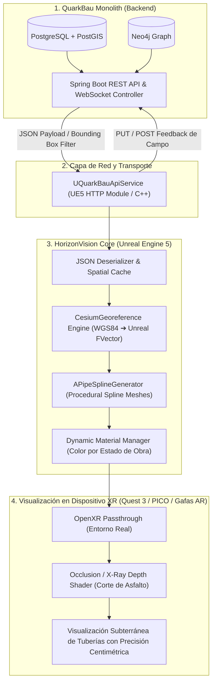
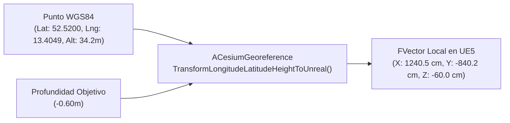
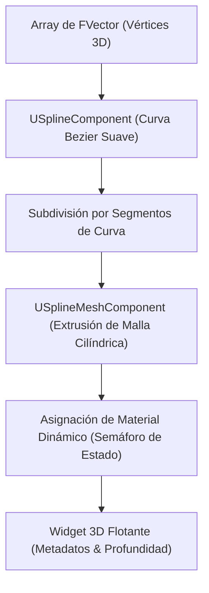
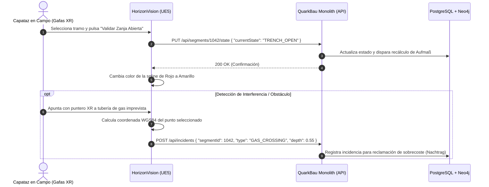

# Plan de Implementación Detallado: Integración QuarkBau Monolith ➔ HorizonVision (MR / Gemelo Digital)

Este documento detalla paso a paso la arquitectura, el flujo de datos, los componentes técnicos y el plan de ejecución para transmitir, georreferenciar y renderizar en tiempo real los segmentos e infraestructuras de **QuarkBau Monolith** (Spring Boot / PostgreSQL + PostGIS) en el visor de Realidad Mixta **HorizonVision** (Unreal Engine 5 + Cesium for Unreal + OpenXR).

---

## 📐 1. Arquitectura General del Sistema



---

## 🚀 2. Fases de Implementación Paso a Paso

---

### 🔹 FASE 1: Preparación del Contrato de Datos y API en QuarkBau Monolith

**Objetivo:** Exponer endpoints optimizados para consumo geoespacial y volumétrico desde dispositivos móviles / XR.

#### 1.1. Estructura de Datos JSON para Segmentos
El endpoint debe proveer las coordenadas WGS84, los atributos de ingeniería civil y el estado del ciclo de vida del segmento:

```json
{
  "id": 1042,
  "projectId": 12,
  "streetName": "Hauptstraße",
  "streetType": "GEHWEG_PFLASTER",
  "workType": "CIVIL_WORK_TRENCHING",
  "currentState": "TRENCH_OPEN",
  "length": 45.8,
  "targetDepthMeters": 0.60,
  "ductDiameterMeters": 0.05,
  "startLatitude": 52.520008,
  "startLongitude": 13.404954,
  "endLatitude": 52.520421,
  "endLongitude": 13.405312,
  "geometry": [
    { "lat": 52.520008, "lng": 13.404954, "z": 34.2 },
    { "lat": 52.520195, "lng": 13.405110, "z": 34.1 },
    { "lat": 52.520421, "lng": 13.405312, "z": 33.9 }
  ],
  "assignedCrew": "Cuadrilla Alpha",
  "hazards": [
    { "type": "GAS_PIPE_CROSSING", "lat": 52.520195, "lng": 13.405110, "depthMeters": 1.10 }
  ]
}
```

#### 1.2. Endpoints del Backend Requeridos
* `GET /api/projects/{projectId}/segments`: Descarga masiva para el proyecto activo.
* `GET /api/segments/nearby?lat={lat}&lng={lng}&radiusMeters={r}`: Consulta espacial optimizada con PostGIS (`ST_DWithin`) para cargar únicamente los tramos dentro del campo de visión del visor (ej. radio de 300-500m).
* `PUT /api/segments/{id}/state`: Actualización del estado de obra desde el visor (`TRENCH_OPEN` ➔ `BLOWN` ➔ `COMPLETED`).
* `POST /api/incidents`: Reporte de incidencias georreferenciadas con fotos tomadas desde las cámaras del visor.

---

### 🔹 FASE 2: Capa de Comunicación e Ingesta en Unreal Engine 5 (C++)

**Objetivo:** Crear el subsistema cliente en C++ para realizar peticiones HTTP autenticadas y deserializar los tramos en memoria.

#### 2.1. Arquitectura de Clases en C++
* **`UQuarkBauApiService` (Hereda de `UGameInstanceSubsystem`):**
    * Maneja la configuración del servidor (`ServerBaseUrl`, `ApiToken`).
    * Ejecuta peticiones asíncronas con `FHttpModule`.
    * Implementa lógica de reintento y caché local para funcionamiento sin conexión (Offline-First en obra).
* **Estructuras de Datos (`USTRUCT`):**
    * `FQuarkBauGeometryPoint`: `double Latitude`, `double Longitude`, `double AltitudeZ`.
    * `FQuarkBauHazard`: `FString HazardType`, `double Lat`, `double Lng`, `double Depth`.
    * `FQuarkBauSegment`: `int64 Id`, `FString StreetName`, `EWorkflowState CurrentState`, `double TargetDepth`, `double DuctDiameter`, `TArray<FQuarkBauGeometryPoint> Geometry`, etc.

#### 2.2. Flujo de Ingesta y Filtrado Espacial
1. Al iniciar la aplicación o cambiar de ubicación GPS en obra, se lanza una consulta a `/api/segments/nearby`.
2. Se procesa el payload JSON entrante usando `FJsonObjectConverter` o `TJsonReader`.
3. Los datos validados se almacenan en un `TMap<int64, FQuarkBauSegment>` en el subsistema para evitar peticiones duplicadas.

---

### 🔹 FASE 3: Motor Geoespacial y Conversión de Coordenadas (Cesium)

**Objetivo:** Transformar coordenadas geográficas esféricas WGS84 (Lat/Long/Alt) a coordenadas cartesianas locales de Unreal Engine en centímetros `FVector(X, Y, Z)`.



#### 3.1. Configuración de `ACesiumGeoreference`
* Se posiciona un actor `ACesiumGeoreference` en el nivel.
* El origen geoespacial del nivel se establece en la coordenada de la arqueta principal o el centro de la zona de obras.

#### 3.2. Transformación y Compensación de Profundidad
1. Para cada punto de la geometría del segmento:
   $$\text{Alt}_{\text{efectiva}} = \text{Alt}_{\text{superficie}} - \text{targetDepthMeters}$$
2. Llamada a la función de conversión de Cesium:
   ```cpp
   glm::dvec3 GeographicCoords(Longitude, Latitude, EffectiveAltitude);
   FVector UnrealWorldLocation = CesiumGeoreference->TransformLongitudeLatitudeHeightToUnreal(GeographicCoords);
   ```
3. Se genera un array ordenado de `FVector` que representa el eje central de la canalización subterránea.

#### 3.3. Calibración Centimétrica en Terreno
Para garantizar que la tubería virtual coincida exactamente con la acera real:
* **Método 1 (GNSS RTK):** Entrada de corrección centimétrica vía Bluetooth de una antena RTK (Emlid / Leica) hacia el visor.
* **Método 2 (Marcador QR / ArUco en Arqueta):** Escaneo de un marcador fijado en una tapa de registro conocida que recalibra el `CesiumGeoreference Origin` con el punto cero real.

---

### 🔹 FASE 4: Generación Procedural 3D de Tubos y Zanjas (`SplineMesh`)

**Objetivo:** Construir proceduralmente la geometría 3D continua de la tubería y la zanja a partir de los vectores transformados.



#### 4.1. Actor C++ `AFiberSegmentActor`
* **Componentes:**
    * `USceneComponent` (Root).
    * `USplineComponent` (Calcula la trayectoria suave de la calle).
    * `TArray<USplineMeshComponent*>` (Geometría procedural extruida).
    * `UWidgetComponent` (Cartel flotante con información de obra).

#### 4.2. Algoritmo de Generación Procedural
1. Limpiar puntos previos del `USplineComponent`.
2. Añadir cada `FVector` con `AddSplinePoint(Location, ESplineCoordinateSpace::World)`.
3. Ajustar los tipos de punto a `Curve` para adaptar las esquinas y giros de la acera.
4. Por cada tramo entre el punto $i$ y el punto $i+1$:
    * Instanciar un `USplineMeshComponent`.
    * Asignar la malla estática de tubo cilíndrico (`SM_FiberDuct`).
    * Configurar `SetStartAndEnd()` con las posiciones y tangentes de la spline.
    * Ajustar la escala de sección según `ductDiameterMeters`.

#### 4.3. Semáforo Dinámico por Estado de Obra
Se crea una `UMaterialInstanceDynamic` sobre el tubo según el `WorkflowState` del Monolito:

| Estado Backend | Color del Tubo en XR | Significado en Obra |
| :--- | :---: | :--- |
| `PLAN` | 🔴 **Rojo Brillante** | Tramo planificado (no excavado). Marca la línea a cortar con disco. |
| `TRENCH_OPEN` | 🟡 **Amarillo Ámbar** | Zanja abierta. Guía de profundidad para el maquinista. |
| `BLOWN` | 🔵 **Azul Eléctrico** | Microconducto colocado y fibra soplada / empalmada. |
| `COMPLETED` | 🟢 **Verde Esmeralda** | Zanja cerrada, repavimentada y certificada para cobro (*Aufmaß*). |

---

### 🔹 FASE 5: Renderizado en Realidad Mixta (Passthrough y Shader Rayos X)

**Objetivo:** Permitir al operario ver el mundo real a través del visor y visualizar las tuberías como si estuvieran enterradas bajo el asfalto.

#### 5.1. Configuración de OpenXR Passthrough
* Activar el plugin `OpenXR` y `MetaXR` / `PICO OpenXR`.
* Habilitar el canal alfa en el viewport para permitir la transparencia sobre el vídeo de las cámaras externas.

#### 5.2. Shader de Oclusión y Corte de Asfalto (Stencil Depth Mask)
1. **Malla de Terreno Virtual:** Se carga la superficie de la calle desde Cesium o un plano de colisión simple alineado con la cota $Z=0$.
2. **Material de Oclusión:**
    * Material con `Blend Mode: Masked` o `Custom Depth Stencil`.
    * Escribe en el búfer de profundidad (Depth Buffer) pero no dibuja píxeles de color (RGB invisible).
3. **Efecto Visual Resultante:**
    * Las tuberías situadas a $-60\text{ cm}$ quedan ocultas detrás del asfalto real.
    * Al activar el modo "Inspección / Rayos X", se dibuja una ventana de zanja virtual que recorta la máscara de oclusión, revelando la tubería 3D y las advertencias de cruces de gas/agua en su cota exacta bajo tierra.

---

### 🔹 FASE 6: Sincronización Bidireccional (HorizonVision ➔ QuarkBau Monolith)

**Objetivo:** Convertir el visor en una herramienta activa de captura y validación en obra civil.



1. **Avance de Obra en 1 Clic:** El operario puede interactuar con el widget 3D flotante mediante gestos con las manos (*Hand Tracking*) o gatillo del mando para marcar el tramo como completado.
2. **Registro de Traza Real (*As-Built*):** Si la excavación tuvo que esquivar una roca, el visor puede registrar nuevos waypoints en tiempo real y enviarlos al monolito para sustituir la geometría teórica por la geometría real ejecutada.
3. **Captura de Incidencias Georreferenciadas:** Envío inmediato al módulo de seguridad (`IncidentController`) de fotos y posición exacta de tubos rotos o cruces no documentados.

---

## 📅 3. Cronograma de Integración por Hitos

| Hito | Entregable Técnico | Duración Estimada |
| :--- | :--- | :---: |
| **Hito 1: API & Contrato de Datos** | Endpoints de segmentos con PostGIS y filtros espaciales en QuarkBau Monolith. | 3 - 5 días |
| **Hito 2: Cliente HTTP en UE5** | Subsistema C++ `UQuarkBauApiService` con deserialización JSON y caché. | 3 - 4 días |
| **Hito 3: Pipeline Geoespacial** | Conversión WGS84 ➔ UE5 con `CesiumGeoreference` y ajuste de cota de profundidad. | 4 - 6 días |
| **Hito 4: Procedural Spline Meshes** | Actor `AFiberSegmentActor` con extrusión de tubos y semáforo de colores. | 4 - 5 días |
| **Hito 5: Shaders Passthrough / XR** | Máscara de oclusión de asfalto y visualización tipo Rayos X en Meta Quest / PICO. | 4 - 6 días |
| **Hito 6: Flujo Bidireccional** | Envío de actualizaciones de estado, incidencias y geometrías As-Built al backend. | 3 - 5 días |

---

## 🛠️ 4. Estructura de Archivos Recomendada en HorizonVision

```text
HorizonVision/
├── Source/HorizonVision/
│   ├── Network/
│   │   ├── QuarkBauApiService.h / .cpp       # Cliente HTTP REST y WebSockets
│   │   └── QuarkBauDataTypes.h               # USTRUCTs de Segmentos, Geometría y Estados
│   ├── Geospatial/
│   │   ├── GeoCoordinateConverter.h / .cpp   # Wrappers de conversión Cesium ➔ Unreal
│   │   └── CalibrationAnchorManager.h / .cpp # Calibración RTK y marcadores QR/ArUco
│   ├── Procedural/
│   │   ├── FiberSegmentActor.h / .cpp        # Generador de Splines y SplineMeshComponents
│   │   └── TrenchMeshGenerator.h / .cpp      # Generador de volumen de zanja 3D
│   └── Interaction/
│       └── XRInspectionController.h / .cpp   # Puntero XR para validación e incidencias
├── Content/
│   ├── Materials/
│   │   ├── M_Duct_StateColor.uasset          # Material dinámico para tubos (Rojo/Amarillo/Azul/Verde)
│   │   └── M_Ground_OcclusionMask.uasset     # Shader de corte de asfalto para Passthrough
│   ├── Meshes/
│   │   └── SM_FiberDuct_Cylinder.uasset      # Malla base para extrusión de tubos
│   └── UI/
│       └── WBP_SegmentFloatingHUD.uasset     # Widget flotante 3D con datos del tramo
└── QUARKBAU_INTEGRATION_PLAN.md              # Este plan de implementación
```
